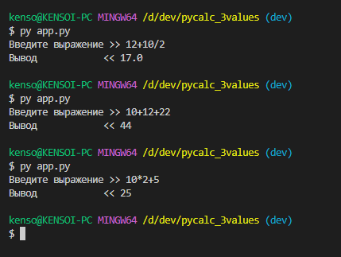

# PyCalc_3Values
**Автор программы**: Прокофьев Андрей  
**Академическая группа**: Фт-210008

## Краткое описание программы
Дана строка, в которой без пробелов записано арифметическое выражение из трех натуральных чисел. Могут быть знаки «+», «-», «*» или «/». Выполнить результат с учетом приоритета математических операций. 

## Инструкции по запуску
Для запуска требуется Python версии 3.7 и выше. Также необходимо клонировать репозиторий на ПК:
```bash
git clone https://github.com/kensoidev/pycalc_3values.git
cd ./pycalc_3values/
```
Запуск производится следующей командой
```bash
python3 app.py
```

## Скриншоты тестов программы
